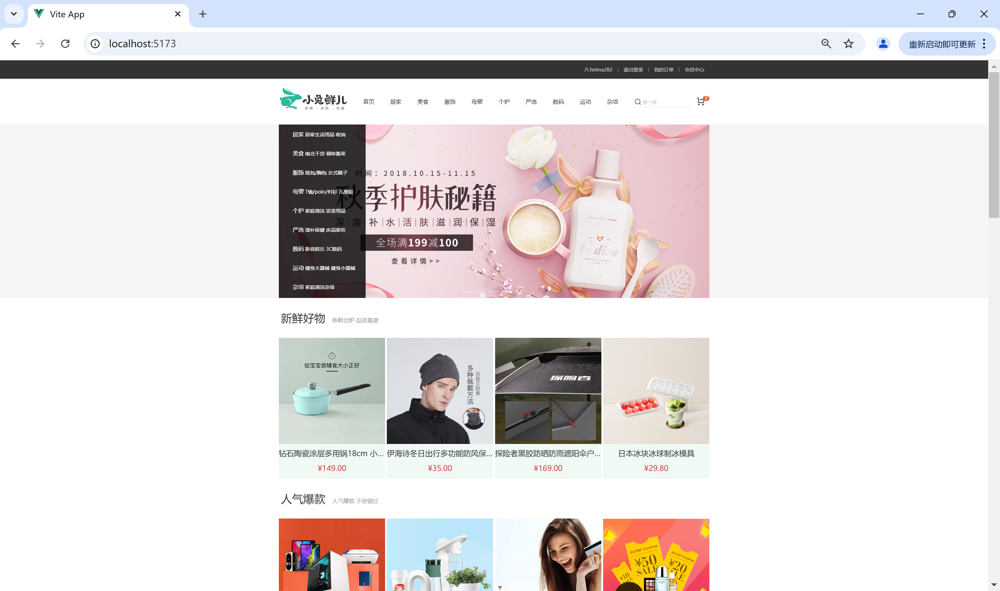
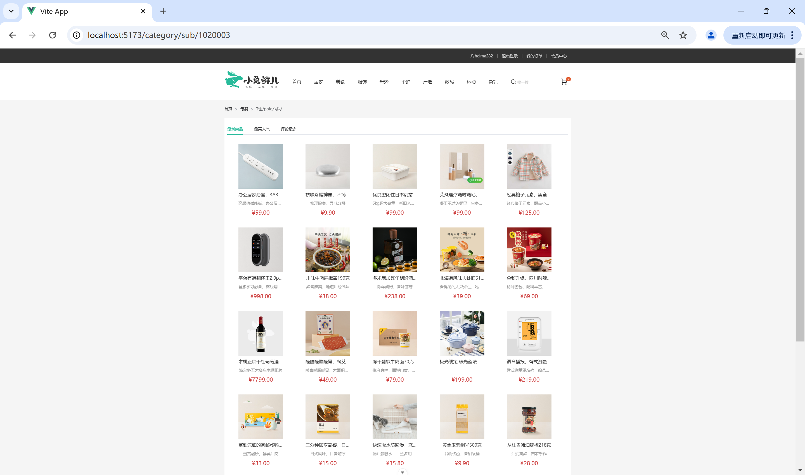
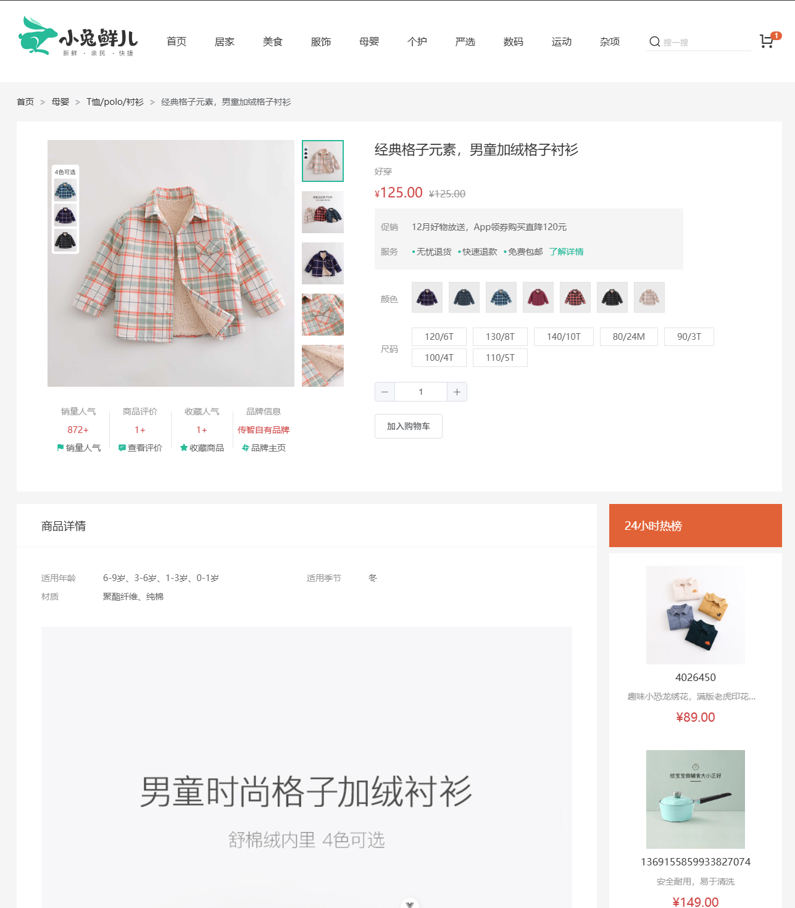
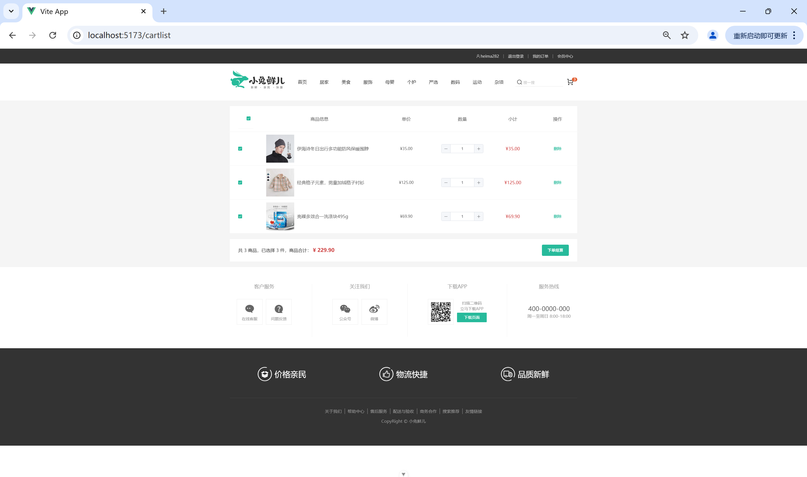

# 多端适配电商 Web 应用

基于 Vue3 + Pinia + Vue Router + Element-Plus 构建的电商前端项目，适配 PC / 平板 / 手机多端，具备完整的商品浏览、购物车、订单流程。

## 技术栈

- **框架**：Vue3 + Vite
- **状态管理**：Pinia
- **路由**：Vue Router
- **UI 组件库**：Element-Plus
- **HTTP 请求**：Axios

## 项目亮点

- **性能优化**：路由懒加载 + 图片懒加载，LCP 优化至 0.72s，首屏 JS 耗时减少 132ms，图片体积减少 25%
- **接口治理**：Axios 二次封装，配置拦截器自动拼接 token、统一错误处理，使用 AbortController 取消重复请求，重复请求减少 90%
- **状态管理**：Pinia 拆分用户 / 商品 / 订单仓库，设计增删改查 action，开发效率提升 30%
- **路由守卫**：三级嵌套路由 + beforeEach 守卫，切换路由时终止未完成请求并清空缓存，INP 优化 78ms
- **组件化**：封装 GoodItem、HomePanel 等通用组件，减少 6 处代码冗余，开发效率提升 40%

## 本地运行

```bash
# 克隆项目
git clone https://github.com/Nanxi-coder-dev/rabbit-website.git

# 进入目录
cd rabbit-website

# 安装依赖
npm install

# 启动开发服务器
npm run dev
```

## 项目截图

|             首页              |                 商品列表                 |
| :---------------------------: | :--------------------------------------: |
|  |  |

| 商品详情（SKU规格选择 + 缩略图切换） |               购物车                |
| :----------------------------------: | :---------------------------------: |
|   |  |

## 目录结构

src/
├── api/ # 接口封装（21 个业务接口）
├── assets/ # 静态资源
├── components/ # 通用组件（ImageView、XtxSku 等）
├── composables/ # 通用方法
├── directive/ # 全局插件（lazy）
├── router/ # 路由配置（三级嵌套 + 路由守卫）
├── stores/ # Pinia 状态管理（cart、user、categoryLst）
├── styles/ # 全局样式（scss）
├── utils/ # 工具函数（Axios 封装）
├── views/ # 页面组件
└── App.vue

## 未来计划

- [ ] 接入 TypeScript
- [ ] 部署至 Vercel
- [ ] 添加单元测试
